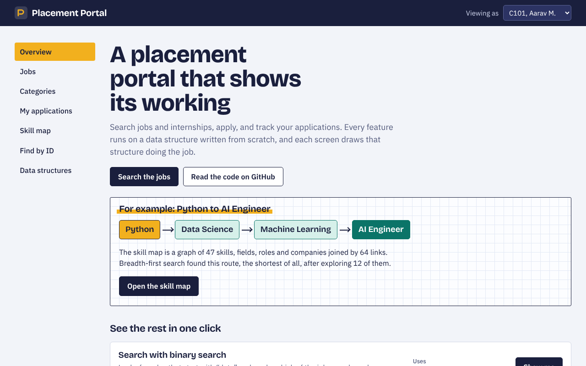
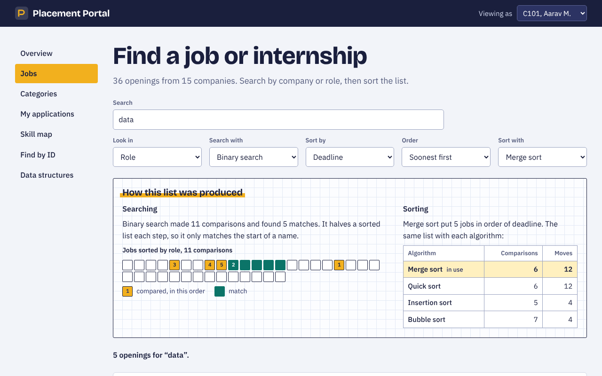
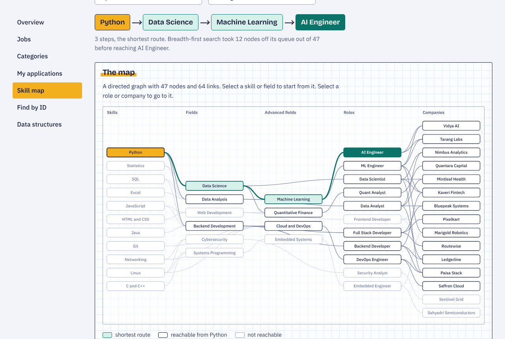
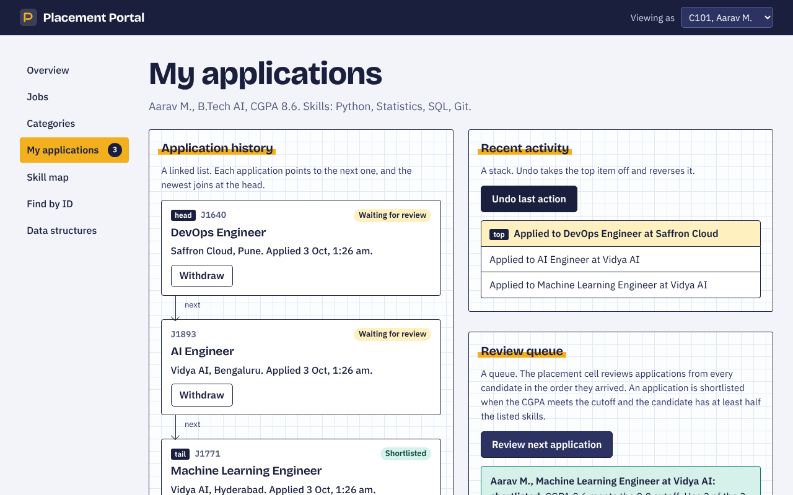
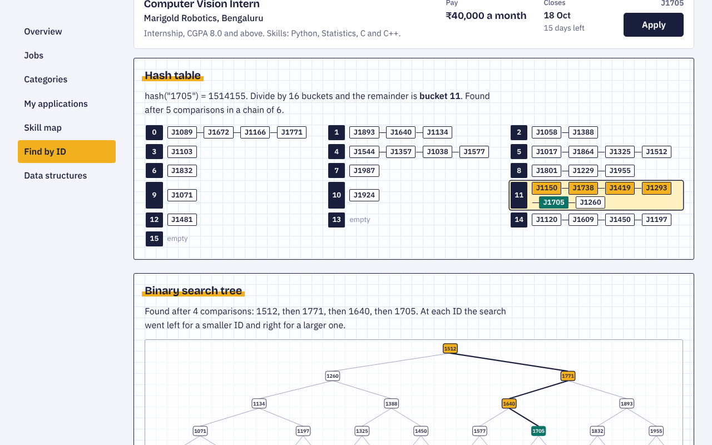

# Student Placement & Job Search Portal

A website where students search internships and jobs, apply, and track their applications. Every feature runs on a data structure or algorithm written from scratch, and each screen draws that structure doing the job.

**[Open the live site](https://shivam-pandyacoder24.github.io/Student-Placement-Job-Search-Portal/)**



## In 30 seconds

- **What it is:** a placement portal with 36 sample openings, a category browser, application tracking with undo, a skill-to-career map and lookup by ID.
- **What makes it different:** it shows its working. Search for a job and it marks which records were compared. Apply and you see the linked list, the undo stack and the review queue change.
- **How it is built:** plain HTML, CSS and JavaScript. No frameworks, no libraries, no build step.
- **How it is checked:** 39 automated tests cover every data structure and the portal logic.

The overview screen has one-click demos, so you can see each part without knowing what to type.

All companies, openings and candidates are sample data made up for this project. Nothing on the site is a real job offer.

## Screenshots

| | |
| --- | --- |
|  **Jobs.** Binary search for "data", with the records it compared marked in order, and the cost of four sorting algorithms side by side. |  **Skill map.** A graph of 47 skills, fields, roles and companies. Breadth-first search finds the shortest route between any two. |
|  **My applications.** History as a linked list, recent activity as a stack with undo, and a review queue shared by all candidates. |  **Find by ID.** The same job found two ways: one hash into a bucket, or a path down a binary search tree. |

## What you can do

- **Jobs** – search by company or role with linear or binary search, and sort by deadline, salary, company or role with merge, quick, insertion or bubble sort.
- **Categories** – browse a category tree. Choosing a category lists every job in it and in the categories below it.
- **My applications** – apply, withdraw and undo. Review the queue to see who is shortlisted and why.
- **Skill map** – pick a skill and a destination to get the shortest route, for example `Python → Data Science → Machine Learning → AI Engineer`.
- **Find by ID** – look up a job or candidate by ID, list all job IDs in a range, and add yourself as a candidate.
- **Data structures** – a table of every structure, where it is used and which file it lives in.

## How each data structure is used

| Topic | Used for | Where to see it | Source |
| --- | --- | --- | --- |
| Arrays | The job records, in a dynamic array that doubles when full | Jobs | `js/dsa/dynamic-array.js` |
| Searching | Linear search (text anywhere in a name) and binary search (start of a name, on a sorted copy) | Jobs | `js/dsa/search.js` |
| Sorting | Merge, quick, insertion and bubble sort by salary, company, deadline or role | Jobs | `js/dsa/sort.js` |
| Linked list | Each candidate's application history; newest at the head, withdraw unlinks a node | My applications | `js/dsa/linked-list.js` |
| Stack | Recent activity; undo pops the last apply or withdraw and reverses it | My applications | `js/dsa/stack.js` |
| Queue | The review queue; applications are reviewed first in, first out | My applications | `js/dsa/queue.js` |
| Tree 1 | General tree of job categories; depth-first walk of a subtree | Categories | `js/dsa/category-tree.js` |
| Tree 2 | Binary search tree of job IDs; single search and range search | Find by ID | `js/dsa/bst.js` |
| Graph | Directed graph of skills, fields, roles and companies; breadth-first shortest path | Skill map | `js/dsa/graph.js` |
| Hashing | Hash table with chaining for job and candidate lookup by ID | Find by ID | `js/dsa/hash-table.js` |

The structures also build on each other: the graph stores its adjacency lists in the hash table, runs breadth-first search with the queue and depth-first search with the stack, and the category tree uses the queue for its level-order walk. None of them use JavaScript's built-in `sort`, `Map` or `Set`.

### Time complexity

| Operation | Cost |
| --- | --- |
| Read a job by array index | O(1) |
| Linear search | O(n) |
| Binary search on a sorted list | O(log n) |
| Merge sort | O(n log n) |
| Quick sort | O(n log n) average, O(n²) worst case |
| Insertion sort, bubble sort | O(n²), O(n) on a list that is already sorted |
| Add an application at the head of the linked list | O(1) |
| Withdraw (find and unlink a node) | O(n) |
| Stack push / pop | O(1) |
| Queue enqueue / dequeue | O(1) |
| Collect the jobs in a category subtree | O(nodes in the subtree) |
| BST search / insert | O(h), where h is the height of the tree |
| Hash table lookup | O(1) average, O(length of the chain) worst case |
| Breadth-first search on the graph | O(V + E) |

## Running it

Nothing to install. Either:

- open `index.html` in a browser, or
- serve the folder and visit http://localhost:8000:

  ```
  python3 -m http.server 8000
  ```

Your applications and any candidates you add are saved in the browser's local storage, and nowhere else. Use "Clear my saved data" in the footer to start again.

## Tests

The data structures and the portal logic are covered by 39 tests that run on Node.js 20 or newer, with no dependencies:

```
node --test
```

The tests check each structure on its own (including against random input), then check the portal: search and sort results, the category tree, the skill map, ID lookup, apply / withdraw / undo / review, and saving and restoring.

## Project layout

```
index.html              the page
css/styles.css          all styling
js/dsa/                 the data structures and algorithms, one file each
js/data/                sample jobs, categories, skill map and candidates
js/portal.js            portal logic: puts each structure to work, no page code
js/app.js               builds each screen and draws the structures
tests/                  tests for js/dsa/ and js/portal.js
screenshots/            images used in this README
```

A few details worth knowing when reading the code:

- Job deadlines are stored as "closes in N days" and turned into dates when the page loads, so the sample data never goes out of date.
- Internship stipends are per month and salaries are per year. Sorting by salary compares both as a yearly figure.
- Jobs are added to the binary search tree in the order they appear in `js/data/jobs.js`. That order is deliberately not sorted by ID, because sorted input would turn the tree into a chain.
- An application is shortlisted when the candidate's CGPA meets the job's cutoff and the candidate has at least half of the listed skills.
- Undoing a withdrawal puts the application back in its old place in the history. If it was still waiting for review, it rejoins the queue at the back.

## Deploying

The site is served by GitHub Pages from the root of the `main` branch (**Settings → Pages → Deploy from a branch → main, / (root)**). Every push to `main` updates the live site within a minute or two.

## Author

Built by [shivam-pandyacoder24](https://github.com/shivam-pandyacoder24) as a college data structures project.
